::: {#home .snap-section .hero}
::: {.hero-content}
# CLAUDIA NANEZ {.hero-text}
:::
:::

::: {#about .snap-section .about}
::: {.about-container}
::: {.about-text}
## About

I am a first year master's student in the dual MA/MSc Innovation Design Engineering (IDE) 
program offered jointly by Imperial College London and the Royal College of Art. 
In May of 2024, I graduated from Harvey Mudd College with a Bachelor of Science in Engineering
and a minor in Studio Art.

With a passion for combining technical innovation with creative design thinking, 
I bring a unique perspective to solving complex challenges at the intersection 
of engineering and design.

When I'm not in the studio, I love to make music, run, and be outdoors!

[Connect →](#contact){.about-button}
:::

::: {.about-image}
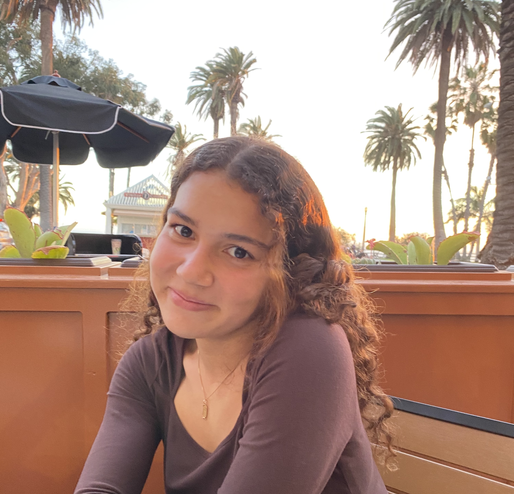
:::
:::
:::

::: {#education .snap-section .education}
## Education

::: {.education-container}
::: {.education-item}

{.education-logo}

### Imperial College London

MA Innovation Design Engineering

September 2025 - September 2027
:::

::: {.education-item}
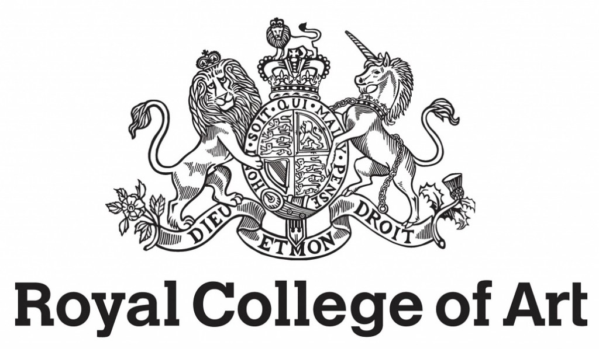{.education-logo}

### Royal College of Art

MSc Innovation Design Engineering

September 2025 - September 2027
:::

::: {.education-item}
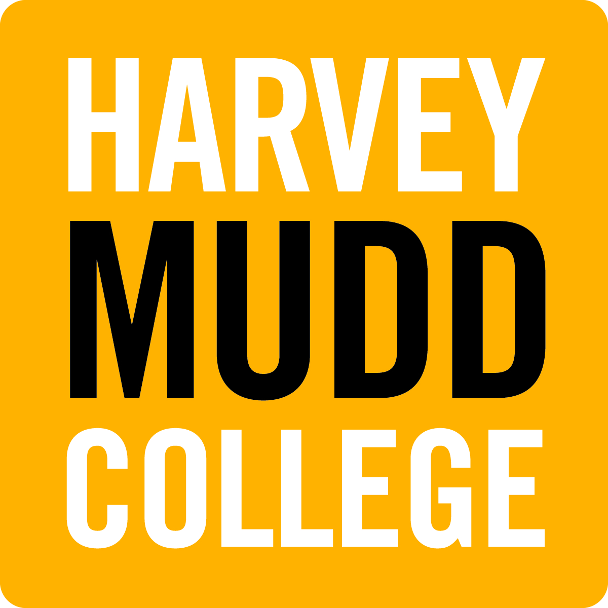{.education-logo}

### Harvey Mudd College

BS Engineering, Minor in Studio Art

August 2020 - May 2024
:::
:::
:::

::: {#professional-experience .snap-section .professional-experience}
## Professional Experience

::: {.experience-container}
::: {.experience-item}
::: {.experience-image}
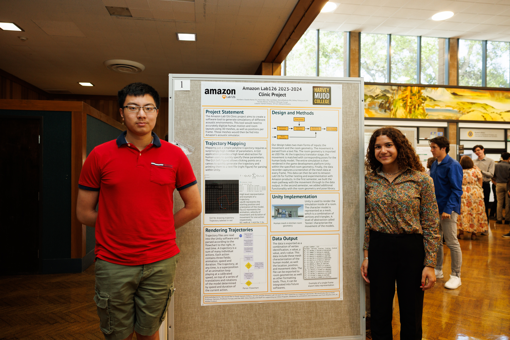

::: {.image-caption}
Me and my team mate next to our poster board during Clinic Presentation Day
:::
:::

### Amazon Lab126

::: {.role}
Harvey Mudd College Clinic Team Lead
:::

::: {.date}
August 2023 - May 2024
:::

- Decreased workflow time by 50% by developing python script to convert information from an audio file to 3D human models
- Led a team of three students, coordinated weekly liaison meetings, managed project reporting, and delivered impactful
presentations to stakeholders

[Learn More →](Amazon126.html){.learn-more-button}
:::

::: {.experience-item}
::: {.experience-image}
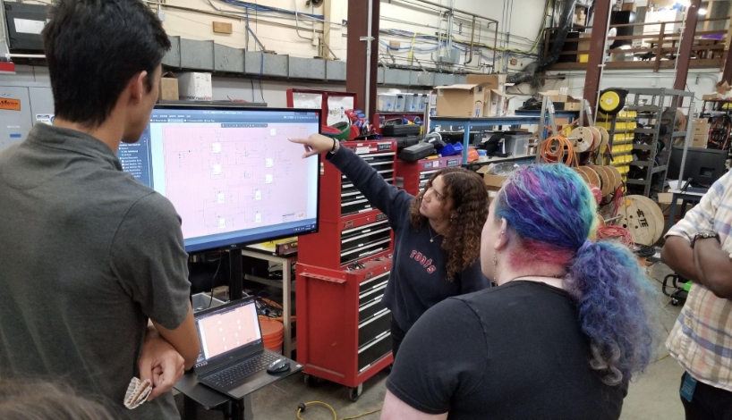

::: {.image-caption}
Presenting my schematic to the Motiv team at the end of the summer
:::
:::

### Motiv Electric Trucks (Now Workhorse)

::: {.role}
Research and Development Intern
:::

::: {.time}
June 2023 - August 2023
:::

- Designed architecture for dual AC and DC power distribution to reduce the charging time of latest electric mid sized vehicles
- Developed printer circuit board (PCB) design from ideation to production, from initial schematic drawings to final product

[Learn More →](motiv.html){.learn-more-button}
:::

::: {.experience-item}
::: {.experience-image}
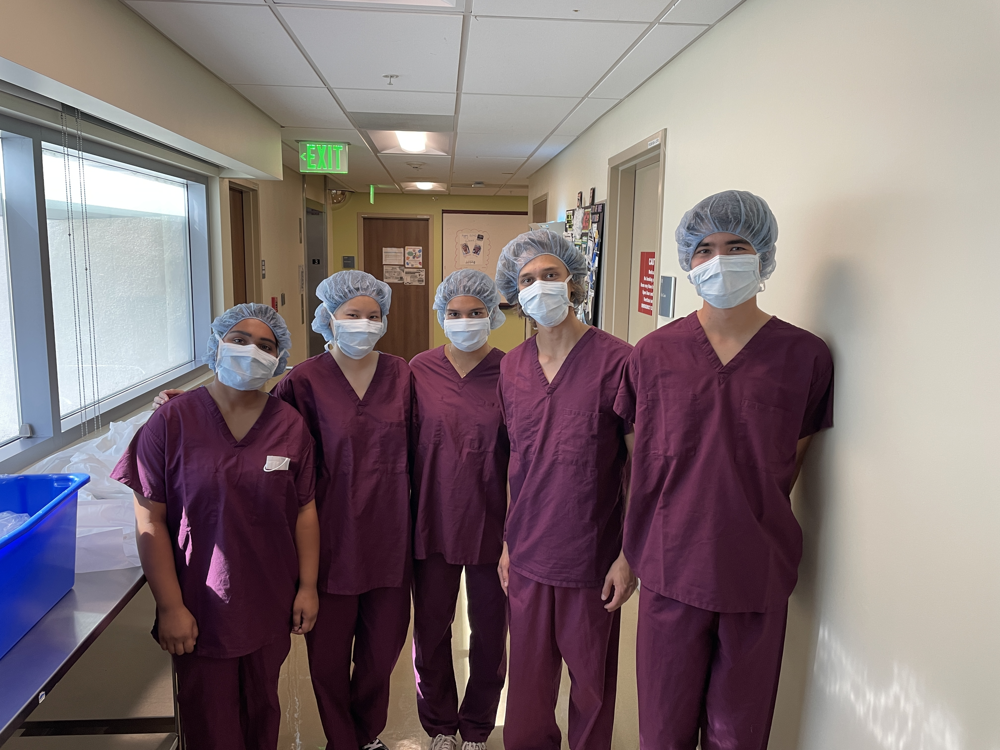

::: {.image-caption}
Me (center) and my teammates at the City of Hope treatment center conducting patient interviews
:::
:::

### City of Hope

::: {.role}
Harvey Mudd College Clinic Team Member
:::

::: {.date}
August 2022 - December 2022
:::

- Built an implantable sensor to be worn by cancer patients to monitor their vitals and drastically improved quality of care
- Collaborated with four students on the ideation, research, and assembly of a sensor equipped with pulse, body temperature,
blood pressure, and pedometer measurement capabilities
- Created software infrastructure to filter the data collected by the sensor, analyze the trends, and send to health care providers
- Led Bill of Materials creation, managed the acquisition and assembly of components, and developed the PCB in Autodesk EAGLE
:::

::: {.experience-item}
::: {.experience-image}
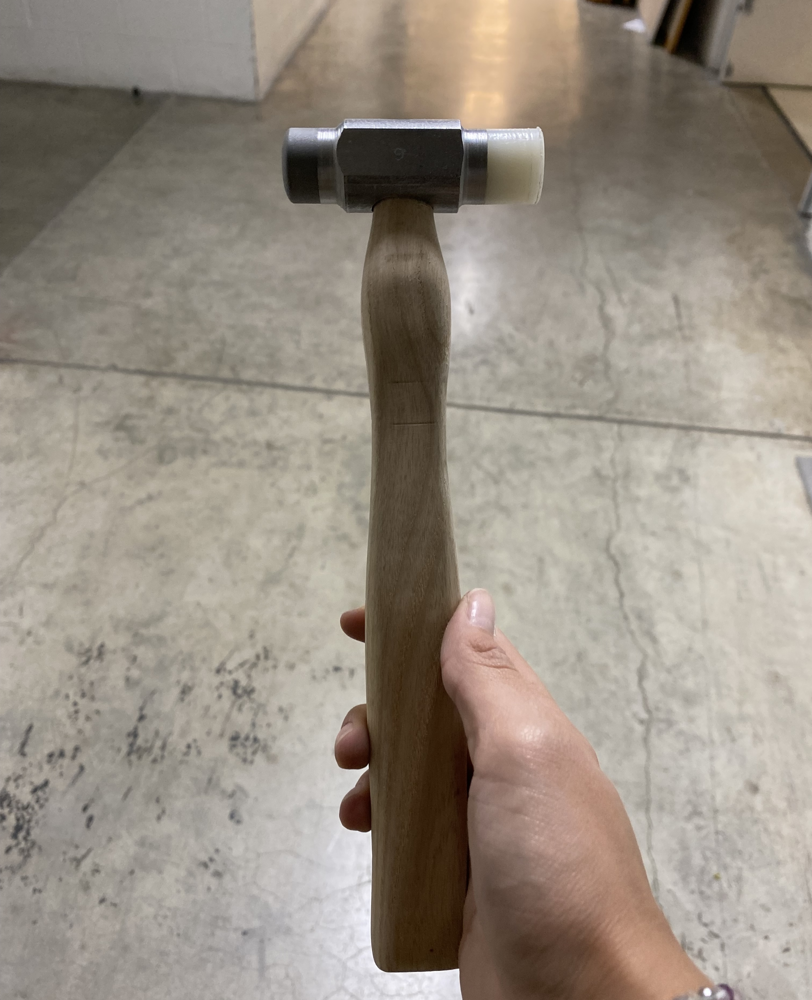

::: {.image-caption}
My hammer that all Engineers make and that machine shop proctors instruct
:::
:::

### Harvey Mudd College Machine Shop

::: {.role}
Machine Shop Proctor
:::

::: {.date}
January 2022 - May 2024
:::

- Co-supervised up to 12 students per shift in a student-run machine shop, ensuring safety, efficiency, and adherence to proper
machining protocols
- Instructed students on how to properly use machines such as the mill, lathe, and vertical band saw for coursework and
individual projects
- Mentored 50 engineering students in the making of a hammer for the required Engineering and Design course every semester

:::

::: {.experience-item}
::: {.experience-image}
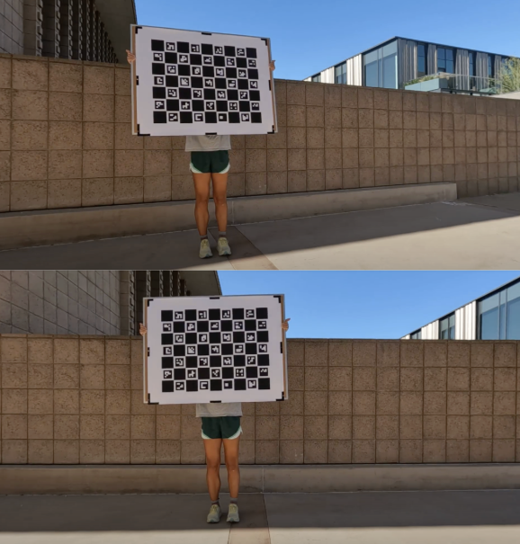

::: {.image-caption}
Me holding the customized checkerboard we used during camera calibration.
:::
:::

### Harvey Mudd College Lab for Autonomous and Intelligent Robotics (LAIR)

::: {.role}
Machine Learning Resarch Assistant
:::

::: {.date}
January 2022 - January 2023
:::

- Established end-to-end workflow in DeepLabCut to extrapolate data from recording skateboarders using 3D calibration
- Performed inverse dynamics to measure kinematic forces exerted on joints for a final research report from the acquired data

[Learn More →](LAIR.html){.learn-more-button}
:::

::: {#projects .snap-section .projects}
## Projects

::: {.experience-container}
::: {.experience-item}
::: {.experience-image}
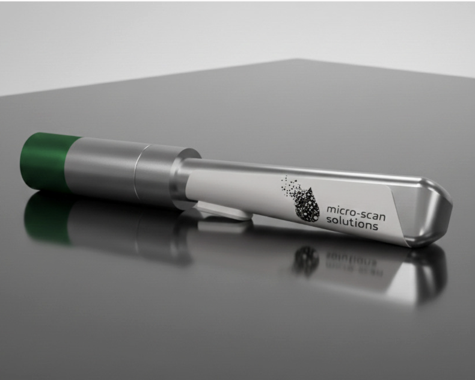

::: {.image-caption}
Your tiny caption text here
:::
:::

### Microplastic Detector

::: {.role}
IDE Transdsciplinary Practices Module Final Project
:::

::: {.time}
November - December 2025
:::

- Designed architecture for dual AC and DC power distribution to reduce the charging time of latest electric mid sized vehicles
- Developed printer circuit board (PCB) design from ideation to production, from initial schematic drawings to final product
- Optimized production costs by aligning design requirements, managed the component library, and maintained accurate Bill of
Materials (BOM)

[Learn More →](TP.html){.learn-more-button}
:::

::: {.experience-item}
::: {.experience-image}
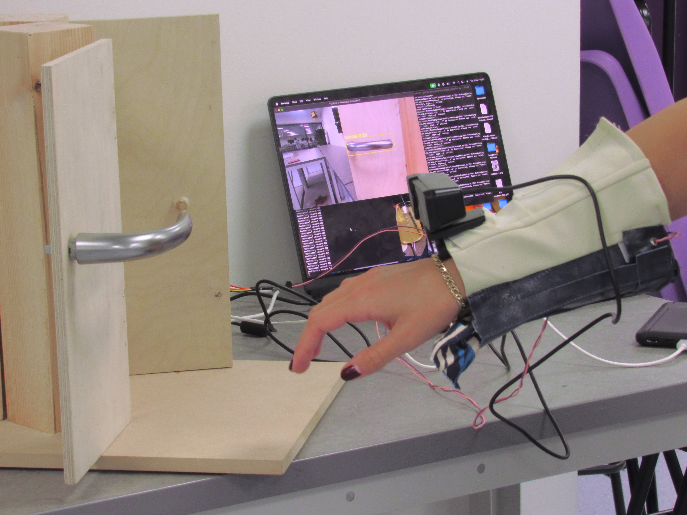

::: {.image-caption}
Your tiny caption text here
:::
:::

### Door Handle Hero

::: {.role}
IDE Cyber Physical Systems Module Final Project
:::

::: {.date}
October - November 2025
:::

- Co-supervised up to 12 students per shift in a student-run machine shop, ensuring safety, efficiency, and adherence to proper
machining protocols
- Instructed students on how to properly use machines such as the mill, lathe, and vertical band saw for coursework and
individual projects
- Mentored 50 engineering students in the making of a hammer for the required Engineering and Design course every semester

[Learn More →](CPS.html){.learn-more-button}
:::

::: {.experience-item}
::: {.experience-image}

::: {.image-caption}
Your tiny caption text here
:::
:::

### Somnia Sleep Collection

::: {.role}
IDE Fundamentals Module Final Project
:::

::: {.date}
September - October 2025
:::

- Established end-to-end workflow in DeepLabCut to extrapolate data from recording skateboarders using 3D calibration
- Performed inverse dynamics to measure kinematic forces exerted on joints for a final research report from the acquired data

[Learn More →](IDEFundamentals.html){.learn-more-button}
:::

::: {.experience-item}
::: {.experience-image}
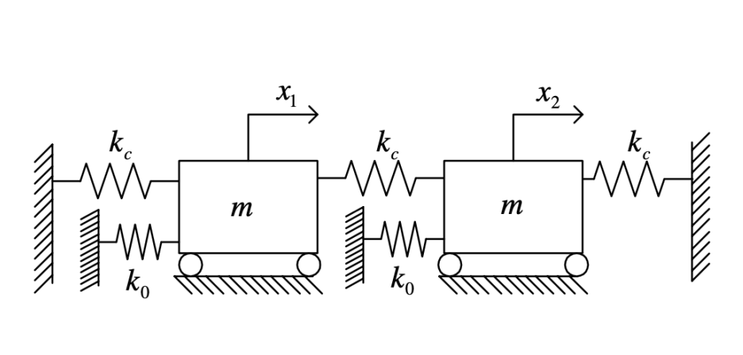

::: {.image-caption}
Your tiny caption text here
:::
:::

### Bladed Disk Simulation 

::: {.role}
E171: Dynamics of Elastic Systems Final Project
:::

::: {.date}
October 2023 - December 2023
:::

- Decreased workflow time by 50% by developing python script to convert information from an audio file to 3D human models
- Improved the spatial audio performance of the Echo by simulating human trajectories in model rooms to observe sound flow
- Led a team of three students, coordinated weekly liaison meetings, managed project reporting, and delivered impactful
presentations to stakeholders

[Learn More →](E171.html){.learn-more-button}
:::

::: {.experience-item}
::: {.experience-image}

::: {.image-caption}
Your tiny caption text here
:::
:::

### Life Cycle Analysis of Grand and Electric Pianos

::: {.role}
Sustainable Design Final Project
:::

::: {.date}
March 2024 - May 2024
:::

- Decreased workflow time by 50% by developing python script to convert information from an audio file to 3D human models
- Improved the spatial audio performance of the Echo by simulating human trajectories in model rooms to observe sound flow
- Led a team of three students, coordinated weekly liaison meetings, managed project reporting, and delivered impactful
presentations to stakeholders

[Learn More →](PianoLCA.html){.learn-more-button}
:::

::: {.experience-item}
::: {.experience-image}
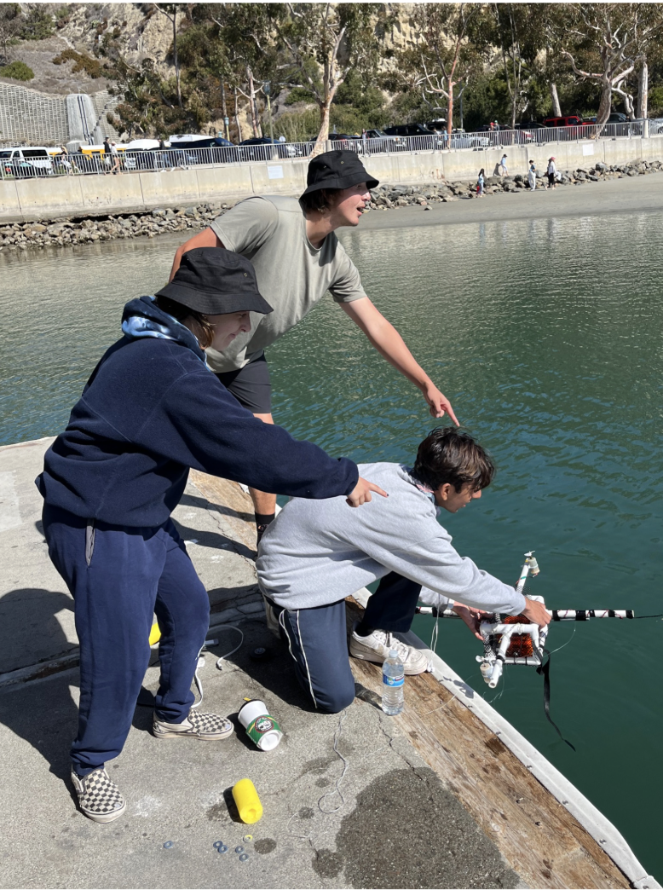

::: {.image-caption}
My teammates with our final AUV during deployment at Dana Point. 
:::
:::

### Autonomous Underwater Vehicle

::: {.role}
E80: Experimental Engineering Final Project
:::

::: {.date}
January 2022 - May 2022
:::

- Decreased workflow time by 50% by developing python script to convert information from an audio file to 3D human models
- Improved the spatial audio performance of the Echo by simulating human trajectories in model rooms to observe sound flow
- Led a team of three students, coordinated weekly liaison meetings, managed project reporting, and delivered impactful
presentations to stakeholders

[Learn More →](E80.html){.learn-more-button}
:::

::: {#contact .snap-section .contact}
## Contact

::: {.contact-container}
::: {.contact-content}
Thanks for stopping by! Let's connect

::: {.contact-layout}
::: {.contact-image}

:::

::: {.contact-info}
::: {.contact-item}
**Email**

[claudia.nanez25@imperial.ac.uk](mailto:claudia.nanez25@imperial.ac.uk)
:::

::: {.contact-item}
**LinkedIn**

[linkedin.com/in/claudinanez](https://linkedin.com/in/claudinanez){target="_blank"}
:::
:::
:::
:::
:::
:::
