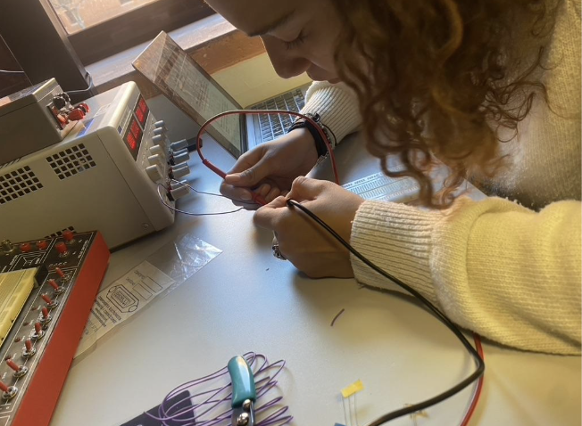
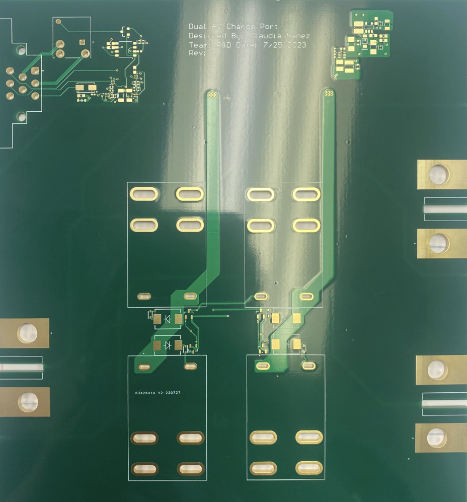

## About This Role

Motiv Electric Trucks (Now under the Workhorse name) is a leading manufacturer of medium-duty commercial all-electric trucks and buses. During the summer of 2023, I was a R&D intern where I designed charging architecture incorporating electronic and mechanical elements for AC power distribution. During the development process, I leveraged design requirements and component library management while working on BOM development. Specifically, I gained experience in the PCB design and manufacturing process working with Altium Designer. 

## Project Gallery

::: {.image-gallery}

:::

## Key Projects

- Project 1 details
- Project 2 details

## Skills Used

- Skill 1
- Skill 2

[← Back to Portfolio](index.html#professional-experience)